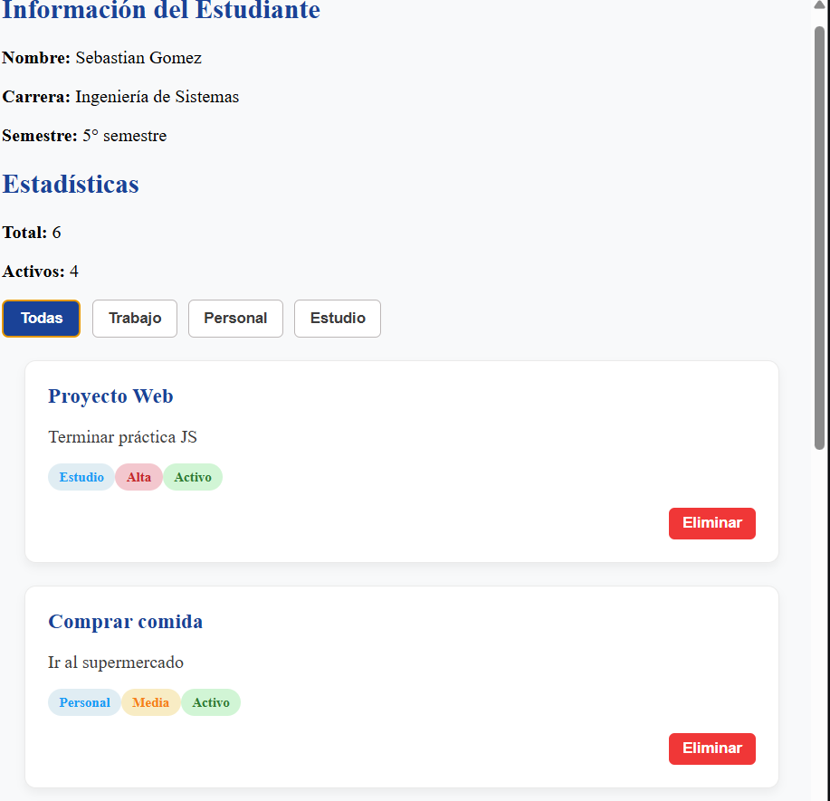
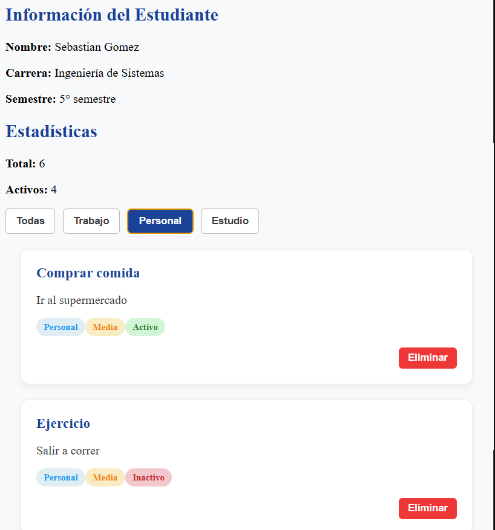

# Practica 2: DOM Basico

**Autor:** Sebastian Gomez

# Descripcion breve de la solución 

Esta aplicación web se desarrollo con **JavaScript**, **HTML** , **CSS** con el objetivo de aplicar los conceptos fundamentales de manipulacion dinamica del DOM garantizando una separacion de responsabilidades entre la estructura, los estilos, la lógica.

En la parte de la interfaz nos permite renderizar trajetas de informacion dinamicamente a partir de un arreglo de objetos, filtar los datos segun su categoria y eliminar.

# Fragmentos de Código Relevantes

### Renderizado de la lista

```javascript
function renderizarLista(datos) {
  const contenedor = document.getElementById('contenedor-lista');
  contenedor.innerHTML = '';

  const fragment = document.createDocumentFragment();

  datos.forEach(el => {

    const card = document.createElement('div');
    card.classList.add('card');

    const titulo = document.createElement('h3');
    titulo.textContent = el.titulo;

    const descripcion = document.createElement('p');
    descripcion.textContent = el.descripcion;

    const categoria = document.createElement('span');
    categoria.textContent = el.categoria;
    categoria.classList.add('badge', 'badge-categoria');

    const prioridad = document.createElement('span');
    prioridad.textContent = el.prioridad;
    prioridad.classList.add('badge');
    if (el.prioridad === 'Alta') {
  prioridad.classList.add('prioridad-alta');
} else if (el.prioridad === 'Media') {
  prioridad.classList.add('prioridad-media');
} else {
  prioridad.classList.add('prioridad-baja');
}

    const estado = document.createElement('span');
    estado.textContent = el.activo ? 'Activo' : 'Inactivo';
    estado.classList.add('badge');
    estado.classList.add(
      el.activo ? 'estado-activo' : 'estado-inactivo'
    );


    const btnEliminar = document.createElement('button');
    btnEliminar.textContent = 'Eliminar';
    btnEliminar.classList.add('btn-eliminar');

    btnEliminar.addEventListener('click', () => {
      eliminarElemento(el.id);
    });

    card.appendChild(titulo);
    card.appendChild(descripcion);
    // CONTENEDOR DE BADGES
    const badges = document.createElement('div');
    badges.classList.add('badges');

    badges.appendChild(categoria);
    badges.appendChild(prioridad);
    badges.appendChild(estado);

    // ACCIONES
    const acciones = document.createElement('div');
    acciones.classList.add('card-actions');
    acciones.appendChild(btnEliminar);

    // ENSAMBLE FINAL
    card.appendChild(titulo);
    card.appendChild(descripcion);
    card.appendChild(badges);
    card.appendChild(acciones);

    fragment.appendChild(card);
  });

  contenedor.appendChild(fragment);
  actualizarEstadisticas();
}
```

### Filtrado de elementos

```javascript
function inicializarFiltros() {
  const botones = document.querySelectorAll('.btn-filtro');

  botones.forEach(btn => {
    btn.addEventListener('click', () => {

      const categoria = btn.dataset.categoria;

      document.querySelectorAll('.btn-filtro').forEach(b => b.classList.remove('btn-filtro-activo'));
      btn.classList.add('btn-filtro-activo');

      if (categoria === 'todas') {
        renderizarLista(elementos);
      } else {
        const filtrados = elementos.filter(e => e.categoria === categoria);
        renderizarLista(filtrados);
      }
    });
  });
}
```
 
### Eliminacion de Elementos

```javascript
function eliminarElemento(id) {
  const index = elementos.findIndex(el => el.id === id);
  if (index !== -1) {
    elementos.splice(index, 1);
    renderizarLista(elementos);
  }
}
```

## Evidencias Visuales

### Vista General



### Vista co Filtrados 

