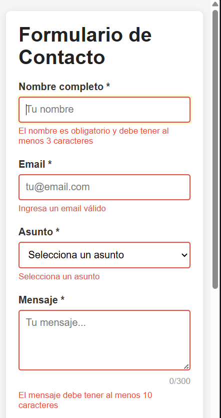
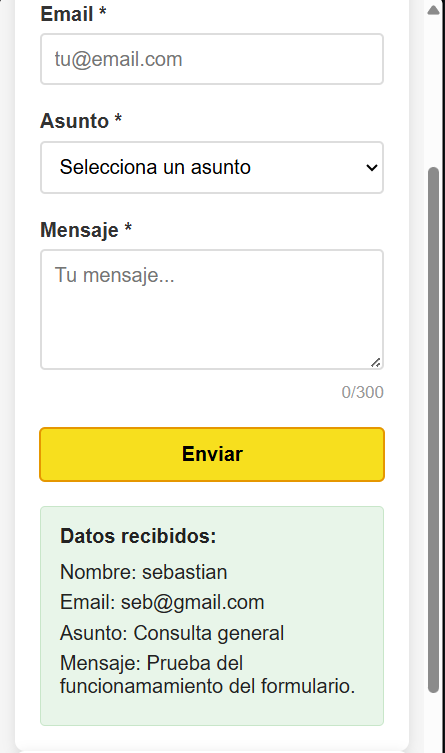
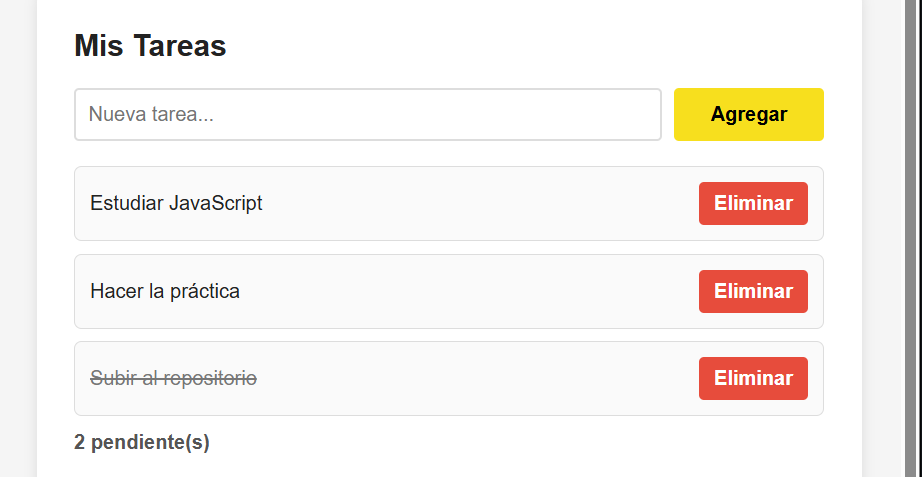

# Practica 3: Eventos 

# Descripcion del Proyecto

Esta práctica demuestra el dominio del DOM y el manjeo de eventos utilizando **Java**, se crea un formulario de contacto y un sistema de gestion de tareas 

# Código Destacado

### 1. Validacion de formulario

```javascript
formulario.addEventListener('submit', (e) => {
  e.preventDefault();


  const nombreValido = validarNombre();
  const emailValido = validarEmail();
  const asuntoValido = validarAsunto();
  const mensajeValido = validarMensaje();

  if(nombreValido && emailValido && asuntoValido && mensajeValido){
    mostrarResultado();
    resetearFormulario();
    return;
  }

  if(!nombreValido){
    inputNombre.focus();
    return;
  }

  if(!emailValido){
    inputEmail.focus();
    return;
  }

  if(!asuntoValido){
    selectAsunto.focus();
    return;
  }

  textMensaje.focus();
});
```

### 2. Delegación de eventos

```javascript
listaTareas.addEventListener('click', (e) => {
  const action = e.target.dataset.action;

  if(!action){
    return;
  }

  const item = e.target.closest('li');
  if(!item || !item.dataset.id){
    return;
  }

  const id = Number(item.dataset.id);

  if(action === 'eliminar'){
    tareas = tareas.filter((tarea) => tarea.id !== id);
    renderizarTareas();
    return;
  }

  if(action === 'toggle'){
    const tarea = tareas.find((itemTarea) => itemTarea.id === id);
    if(tarea){
      tarea.completada = !tarea.completada;
      renderizarTareas();
    }
  }
});
```

### 3. Atajo de teclado (Ctrl + Enter)
```javascript
document.addEventListener('keydown', (e) =>{
  if(e.ctrlKey && e.key === 'Enter'){
    e.preventDefault();
    formulario.requestSubmit();
  }
});
```




