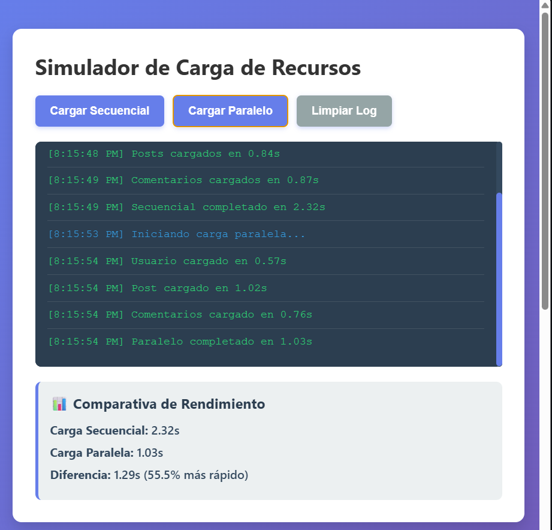
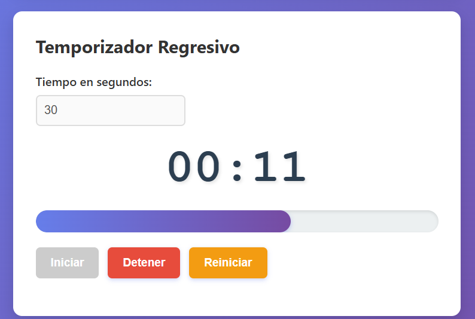
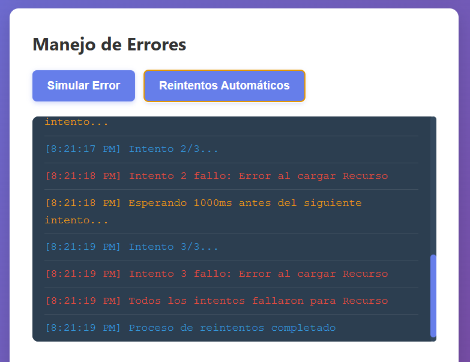

# Practica 5: Asincronia

**Autor**: Sebastián Gómez.

## Descripcion del Proyecto

ESte proyecto es una implementacion práctica para comprendedr y aplicar la programación asíncrona en JavaScript.

# Análisis: Carga Secuencial y Paralela

**Carga Secuencial:** Cada petición espera a que la anterior termine para poder iniciar, el tiempo total de carga es la suma de los retrasos individuales, es útil solo cuando una petición depende estrictamente de los datos de la anterior.

**Carga Paralela:** Todas las peticiones se lanzan de manera simultánea, el tiempo total de carga es equivalente únicamente al tiempo de la petición mas lenta.

**Conclusión:** Para recursos independientes la carga paralela resulta ser entre un **50% y 70% más rápida**, mejorando significativamente la experiencia del usuario final.

## Fragmentos de Código Destacado

A continuación se presentan las implementaciones clave del proyecto:

### 1. Promesa base con `setTimeout`
```javascript
function simularPeticion(nombre, tiempoMin = 500, tiempoMax = 2000, fallar = false) {
  return new Promise((resolve, reject) => {
    const tiempoDelay = Math.floor(Math.random() * (tiempoMax - tiempoMin + 1)) + tiempoMin;

    setTimeout(() => {
      if (fallar) {
        reject(new Error(`Error al cargar ${nombre}`));
      } else {
        resolve({
          nombre,
          tiempo: tiempoDelay,
          timestamp: new Date().toLocaleTimeString()
        });
      }
    }, tiempoDelay);
  });
}
```

### 2. Ejecución Paralela

```javascript
async function cargarParalelo() {
  mostrarLog('Iniciando carga paralela...', 'info');
  resultados.classList.remove('visible');

  const inicio = performance.now();

  try{
    const promesas = [
      simularPeticion('Usuario', 500, 1000),
      simularPeticion('Post', 750, 1500),
      simularPeticion('Comentarios', 600, 1200)
    ];

    const resultadosPromesas = await Promise.all(promesas);

    resultadosPromesas.forEach((resultado) => {
      mostrarLog(`${resultado.nombre} cargado en ${formatearTiempo(resultado.tiempo)}`, 'success');
    });

    const fin = performance.now();
    const total = fin - inicio;
    tiempoParalelo = total;

    mostrarLog(`Paralelo completado en ${formatearTiempo(total)}`, 'success');
    mostrarComparativa();
  }
  catch(error){
    mostrarLog(`Error: ${error.message}`, 'error');
  }
}
```

### 3. Temporizador con setInterval

```javascript
  intervaloId = setInterval(() =>{
    tiempoRestante--;
    actualizarDisplay();

    if(tiempoRestante <=0){
      detener();
      display.classList.add('alerta');
      alert('¡Tiempo terminado!');
    }
  }, 1000);
}
```
### Manejo de Errores Seguros

```javascript
async function simularError() {
  mostrarLogError('Intentando operacion que fallara...', 'info');

  try{
    await simularPeticion('API', 500, 1000, true);
    mostrarLogError('Operacion exitosa', 'success');
  }
  catch(error){
    mostrarLogError(`Error capturado: ${error.message}`, 'error');
    mostrarLogError('El error fue manejado correctamente con try/catch', 'info');
  }
}
```

### Resultados y Evidencias






