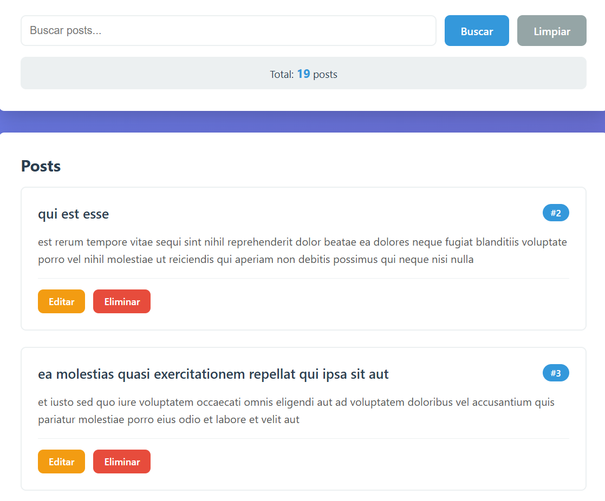
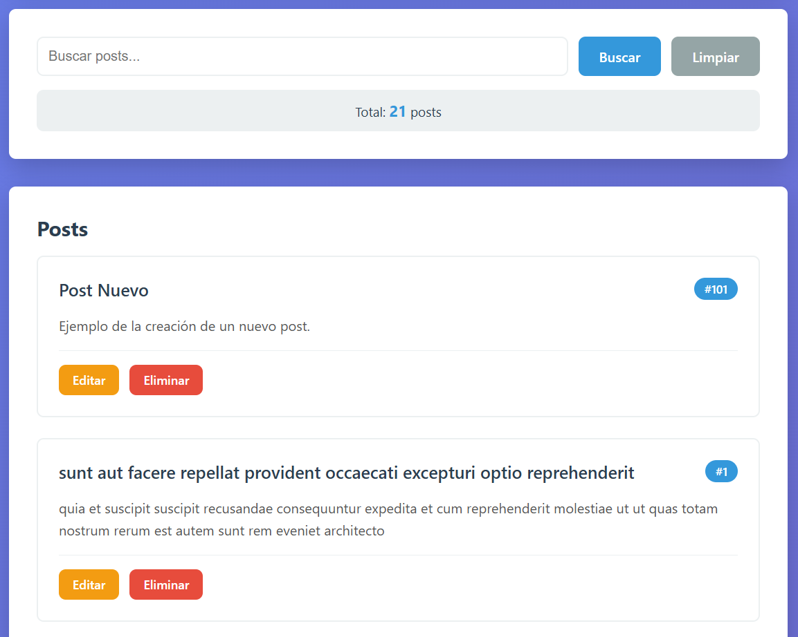
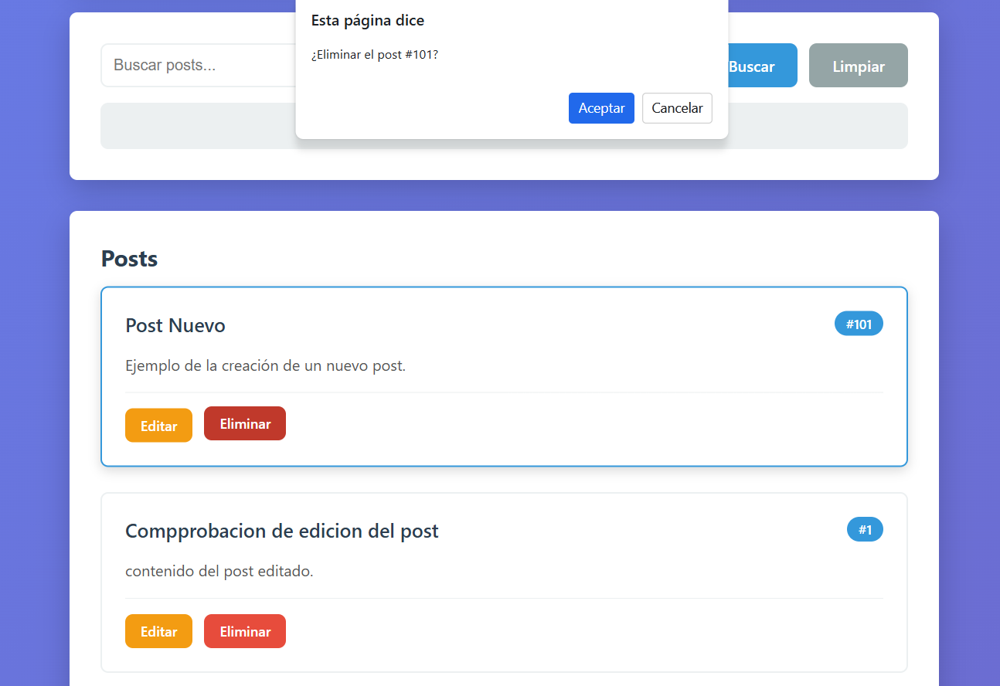
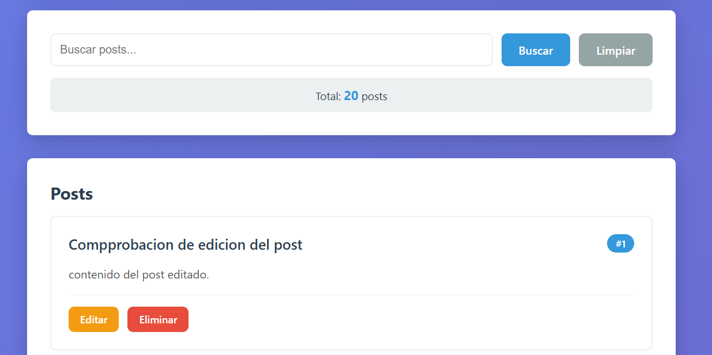
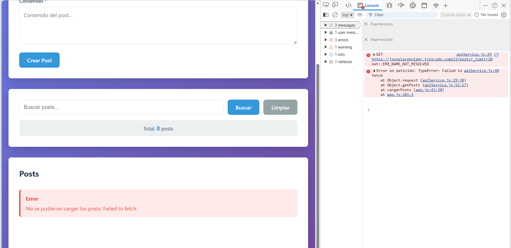
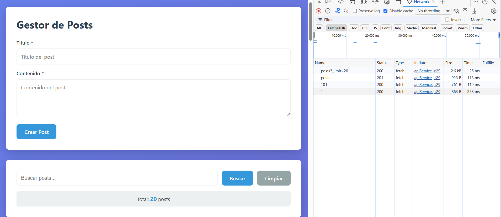
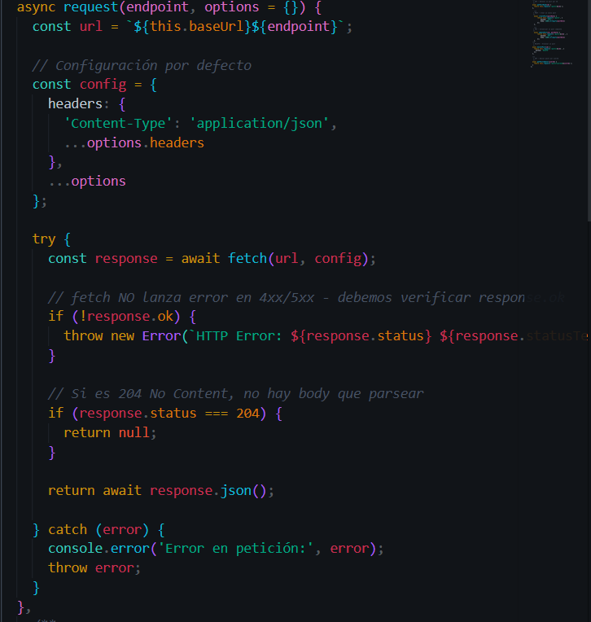
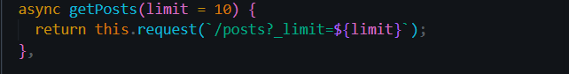
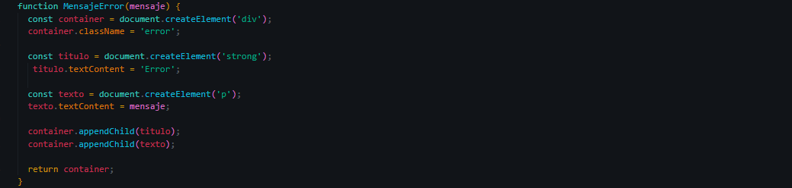
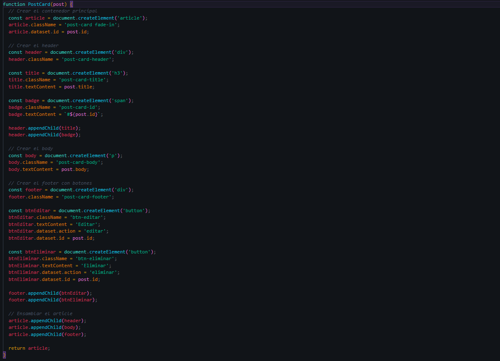

# Practica 6: Fetch Api

### 1. Datos cargados desde la API (GET)

**Descripcion:** Se obtenien los 20 registros inicales desde la API de JSONPlaceholder utilizanod el metodo HTTP `GET.

### 2. Estado de carga (Spinner)

**Descripcion:** Se visualiza el spinner de carga que se renderiza temporalmente en el contenedor principal mientras se resuelve la promesa de la peticion `fetch`.

### 3. Crear Post (POST)

**Descripcion:** Operacion exitosa, tras enviar el formulario se ejecuta una peticion `POST`, al recibir el codigo de estado `201 Created` la interfaz añade un nuevo registro.

### 4. Editar Post (PUT)

**Descricion:** Al activar el boton "Actualizar" el formulario se autocompleta con los datos existentes, tras modificar la informacion y guardar, se realiza una peticion `PUT`, actualizando instantaneamente la tarjeta correspondiente en la interfaz grafica.

### 5. Eliminar Post (DELETE)

**Descripcion:** Uso del metodo `DELETE`. Se implemento un cuadro de dialogo para confirmar y evitar eliminaciones accindentales, una vez confirmada la accion, es removido el post.

### 6. Manejo de Errores.

**Descripcion:** Simulando fallo un fallo de red, el bloque `try catch` captura de excepcion en lugar de que la aplicacion colapse o quede en blanco.

### 7. Devtool Network

**Descripcion:** Se observa el ciclo completo de las operaciones CRUD:
- `GET`inicial para cargar los 20 post (Status 200).
- `POST`para la creacion de un nuevo recurso (Status 201).
- `PUT` y `Delete`aplicados a IDs especificos (Status 200).

### 8. Capturas del Servicio API y Componentes

**Descripcion:** Capturas de las secciones clave del codigo. 
