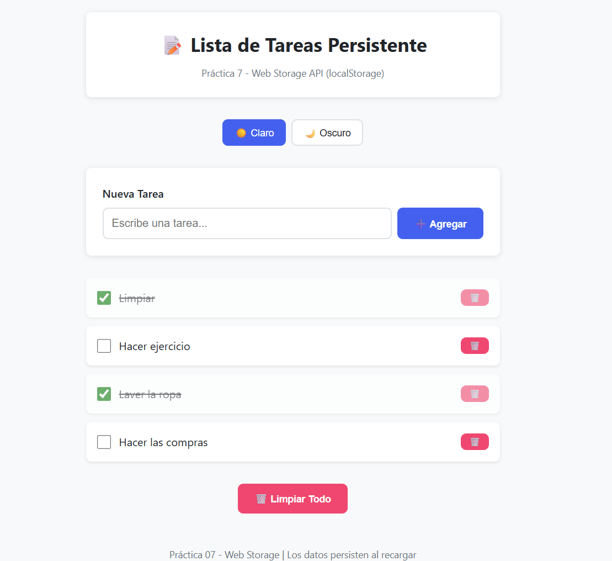
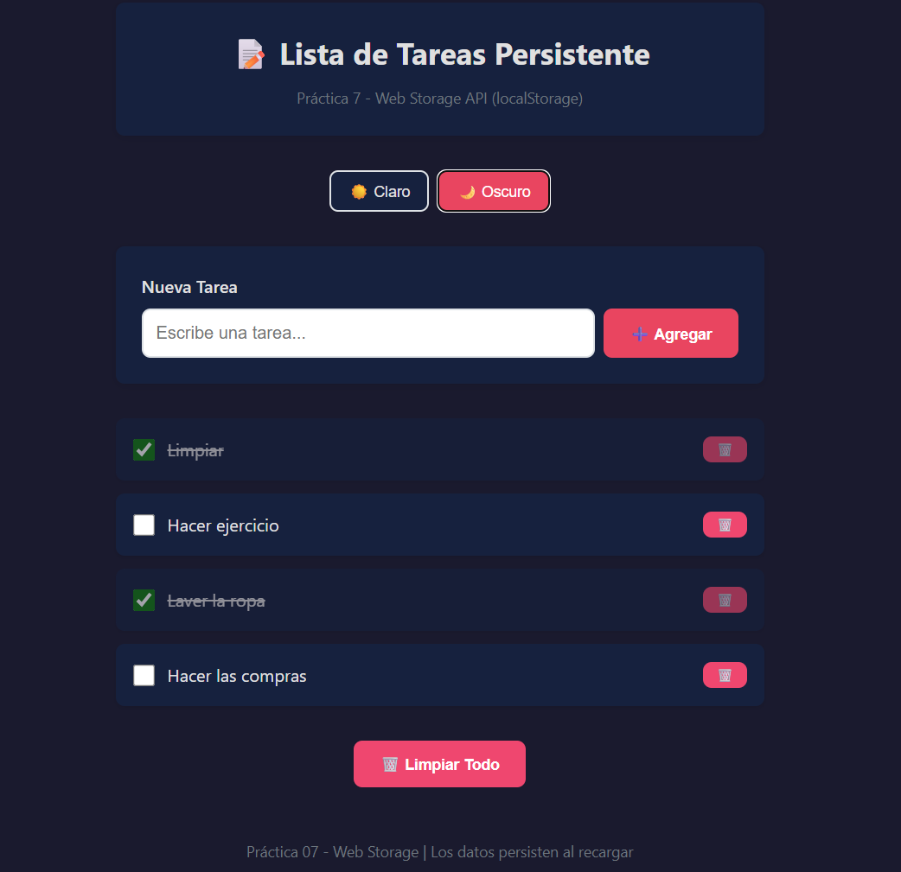
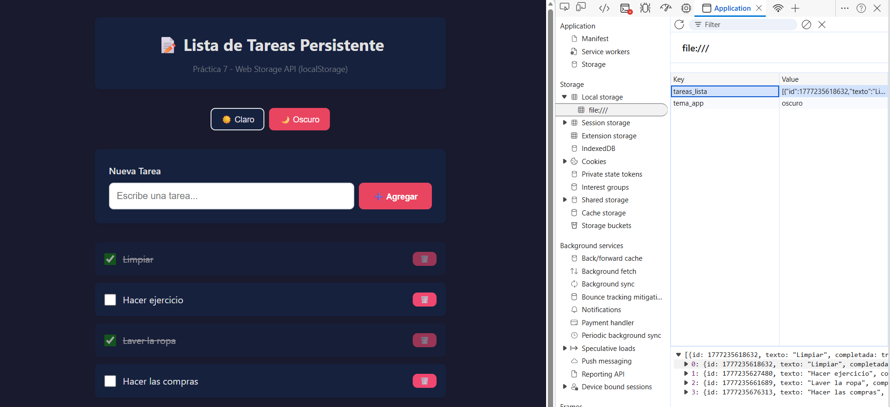
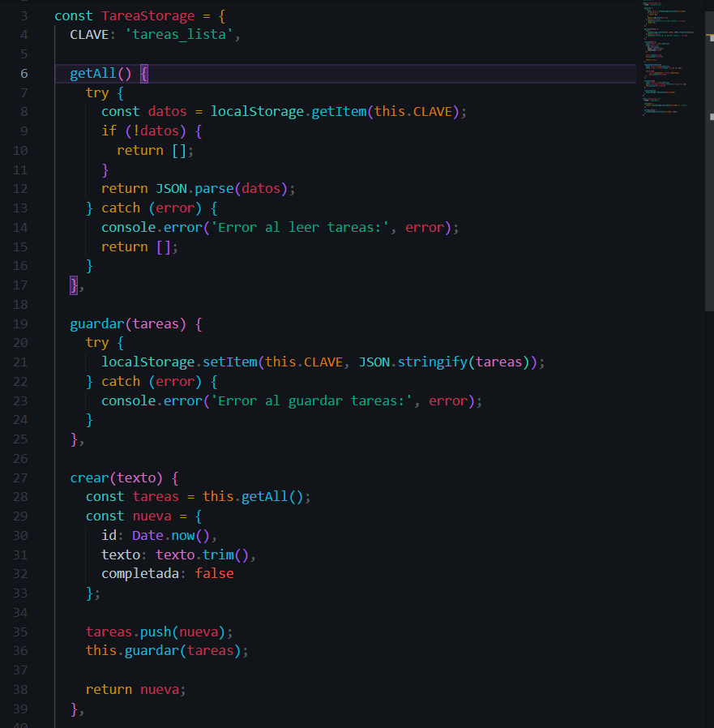

# Practica 7: Storage

## Resultados y Evidencias

### 1. Lista con datos 

**Descripcion:** Se agregaron varias tareas a la lista incluyendo tareas pendientes y completadas, ademas después de recargar la pagina los datos se recuperan exitosamente desde el `localStorage`manteneniendo el estado de las tareas.

### 2. Temas Oscuro

**Descripcion:** Se aplico el cambio de tema, la preferencia del usuario tambien persiste al recragar la pagina.

### 4. DevTools - Local Storage

**Descripcion:** Vista de las herramientas de desarrollar (Applicacion > LocalStorage) donde se comprueba que el array de atreas se esta guardando correctamente en formato JSON bajo la clave `tareas_lista`y el tema bajo `tema_app`.

### 5. Implementacion del Servicio de Storage (Código)

**Descripcion:** Captura del archivo `storage.js` mostrando la definición del objeto `TareaStorage`se evidencia la encapsulacion de las operaciones de `localStorage`y la implementacion de buenas practicas como el manejo de errores mediante bloques `try/catch`.