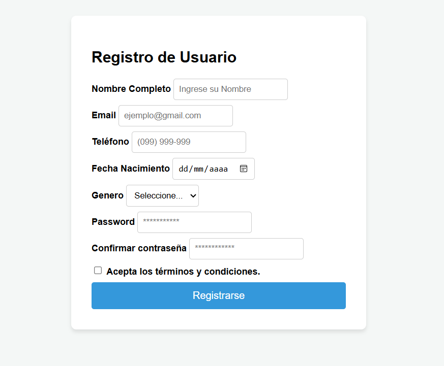
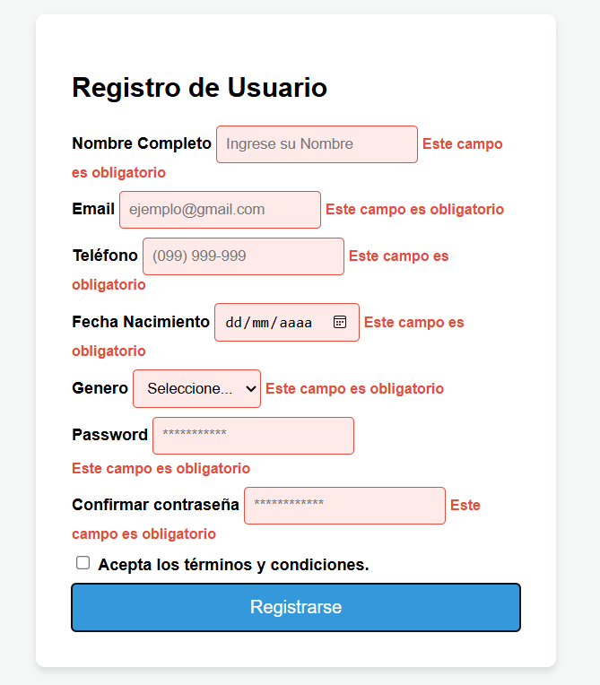
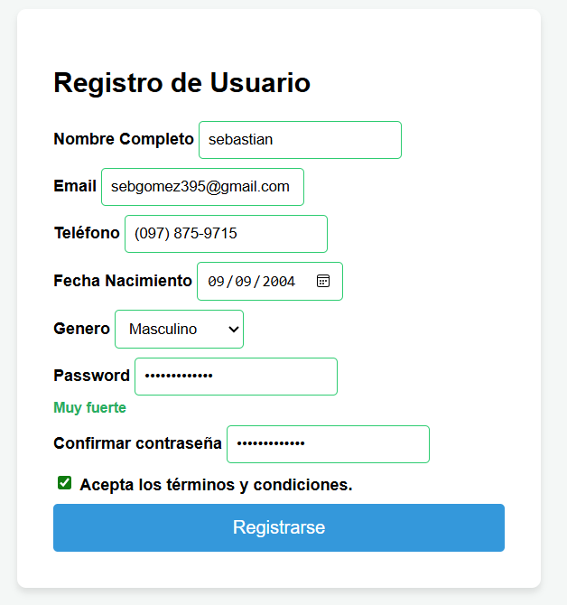
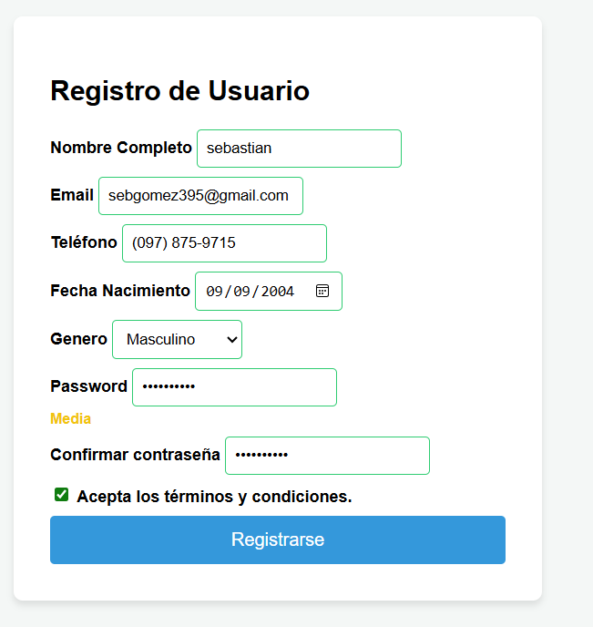
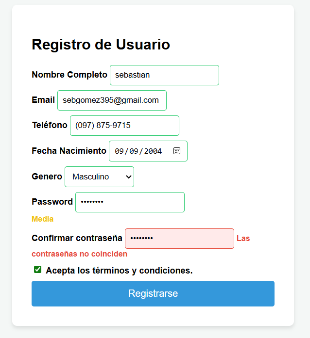
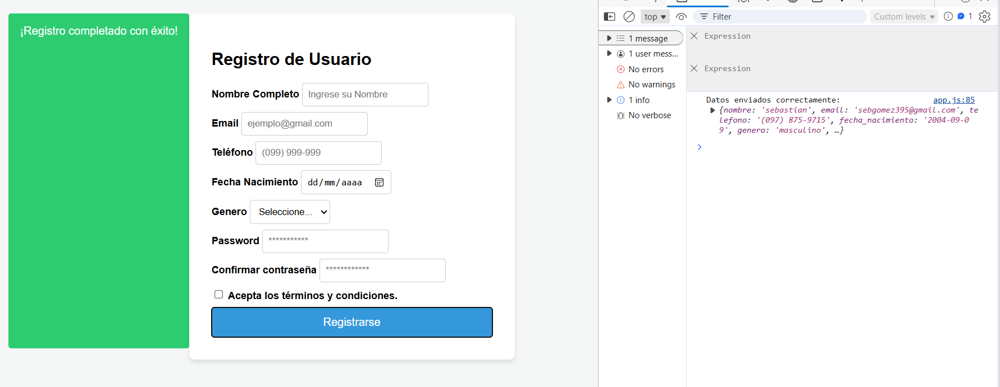
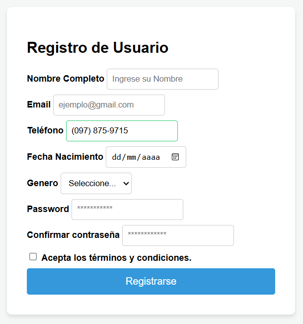
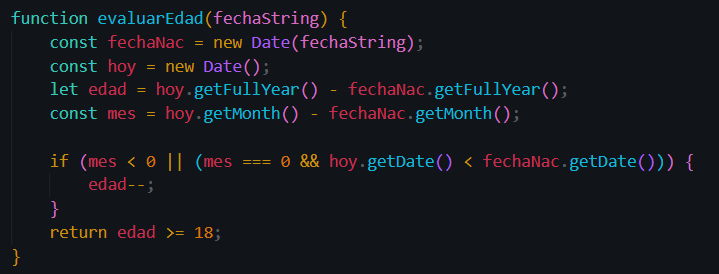
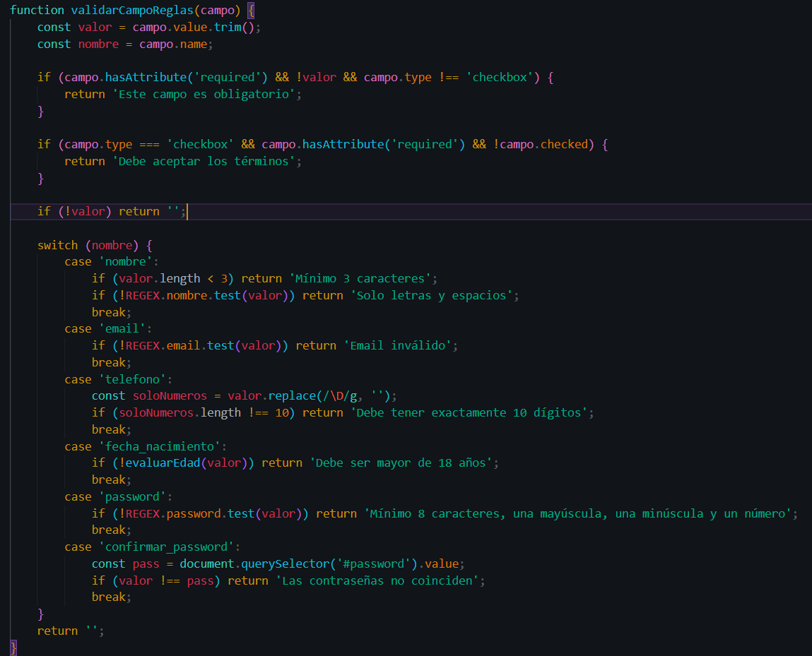

# 08 - Formularios y Validación

### 1. Formulario vacío

**Descripcion:** Vista inicial del formulario de registro al cargar la pagina, no hay validaciones activas aún.

### 2. Errores de validación

**Descripcion:** Al intentar enviar el formulario vacío o al salir de un campo con datos incorrectos, se activa el evento `focus`y se aplica bordes rojos junto con mensajes descriptivos por cada tipo de error.

### 3. Campos válidos

**Descripcion:** Cuanod el usuario ingresa datos que cumple con las expresiones regulares y las reglas de negocio, los campos reciben retroalimentacion positiva (borde verde).

### 4. Fuerza contraseña

**Descripcion:** Indicador dinámico que evalúa la contraseña en tiempo real mediante el evento `iput, cambiando el texto y color según la longitud y el uso de caracteres alfanumercos. 

### 5. Confirmación de contraseña

**Descripcion:** Validación cruzada que compara el valor del campo "Confirmar contraseña" con el campo original, mostrando un error especifico si no son identicas.

### 6. Envio exitoso y FormData

**Descripcion:** Al pasar todas las validaciones, se previene el comportamiento por defecto (`preventDefault`) se extraen los datos con `FormData` y `Object.fromEntries`, se muestra en la consola y se despliega un mensajede exito, limpiando el formulario despues.

### 7. Funcionalidad Extra: Máscara de Teléfono

**Descripcion:** Formateo visual en tiempo real aplicando una máscara al campo de teléfono mediante manipulación de strings en el evento `input` transformando digitos platos al formato `(xxx) xxx-xxx`.

### 8. Código de validación

**Description:** Captura de la funcion modularizada encargada de procesar las reglas de validación y las expresiones regulares.

